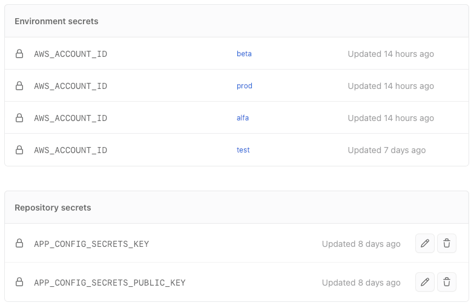
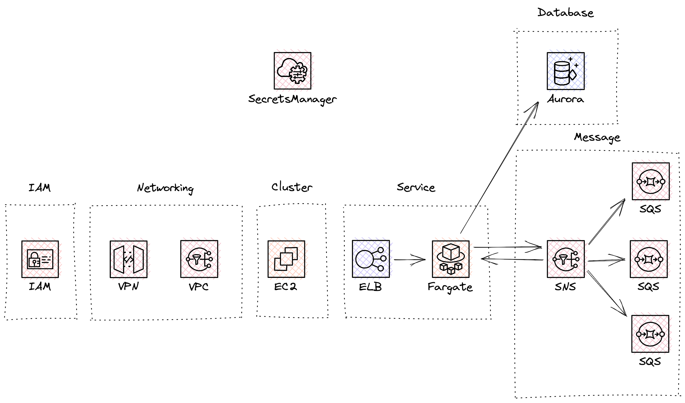
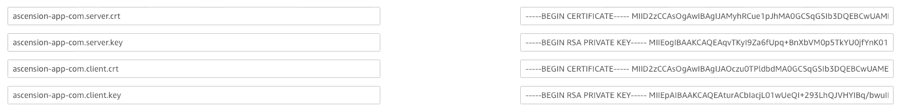

# Backend Infrastructure template

BE infrastructure template.

## How to use this template

1. When creating a new GitHub repository, use this repository as the template to initialize your repository.

2. Next, add the required fields to the [service configuration](./cmd/aws/config.ts) and update the configuration (if applicable) and the relevant service secrets in the AWS parameter store. At the very least, most services will need `AUTH_SECRET` and `HASH_PEPPER`.

> The following path structure is recommended for the secrets in parameter store: `/example.io/${env}/svc/api/AUTH_SECRET`. The secrets are versioned using the native parameter store versioning mechanism.

3. Next, update the `appName` in the configuration and package `name` and `bin` in `package{-lock}.json`.

4. [optional] Make changes to the [`IAM`](./lib/aws/stack/iam.ts) stack.

5. Setup GitHub Actions environments:

  a) create the following environments: `test`, `dev`, `stg`, `production`
  b) add `AWS_ACCOUNT_ID` secret to all of the environments

  The secrets should look like this:

<p align="center">
  
</p>

6. Bootstrap and Deploy the CDK

You'll need `AWS_ACCOUNT_ID` environment variable set. You can either `export` it directly in the shell or use the local `.env` file in the root (remember to call make targets using `dotenv` then). The CDK will also require AWS API keys. Make sure you have the access key and secret key set either in `~/.aws/config` or `~/.aws/credentials`.

The first time you set up an AWS environment, you should run CDK using the AWS `Admin`, since this will create the `IAM` stack that will be shared across all environments and roles for Developers and CI/CD. It is recommended to run it from the local machine.

a) Run `dotenv make aws-cdk-bootstrap` to bootstrap the environment
b) Run `dotenv make aws-cdk-deploy AWS_ENVIRONMENT=dev` to deploy the infrastructure of the `dev` environment

> **!important** The first run will create [`cdk.context.json`](./cdk.context.json) file. Commit this file along with the changes to GitHub.

7. Add identity provider for GitHub CI/CD

To be able to run the `Deploy` and `Rollout` actions from the GitHub Actions environment, you need to **add an identity provider** to the AWS account (see [Creating OIDC identity providers](https://docs.aws.amazon.com/IAM/latest/UserGuide/id_roles_providers_create_oidc.html) and [Configuring OIDC in AWS](https://docs.github.com/en/actions/deployment/security-hardening-your-deployments/configuring-openid-connect-in-amazon-web-services)). The CDK already configures the role for you, so manually adding the identity provider should be sufficient.


## AWS Infrastructure

The repository defines an AWS infrastructure using AWS [CDK]. The CDK (Cloud Development Kit) is an open-source software development framework to define your cloud application resources.
The infrastructure is defined on a rather granular level such that cluster resources, service resources, storage resources, etc. are divided into the relevant stacks. The separation of concerns makes the application deployment
faster to execute and easier to maintain.

The App defines the following stacks:

<p align="center">
  
</p>

Some of the stacks have dependencies, such as `Service` stack, which requires most of the previous stacks to be present and deployed along with the stack.
The dependent stacks, such as `Network` or `Cluster` stack, can't be changed without removing the dependent stack. This means that to change the properties of the Cluster stack, the Service stack needs to be removed. Watch out for this!

## Deployment

It is recommended to use GitHub actions for the deployment of the CDK application. There is a [deployment workflow](./.github/workflows/deploy.yaml) that takes the following input parameters:

- a branch or tag to be deployed from
- environment (one of dev, stg, production)

2. Update the relevant configuration file for the given environment
3. Update the CHANGELOG
4. Create a PR
5. Once approved, merge the changes and create a tag/release

## Local Development

0. Set AWS credentials in your `~/.aws/config` file.
1. Set AWS_ACCOUNT_ID and AWS_ENVIRONMENT variables.
2. Set the parameters in the `./cmd/aws/config.ts` configuration file.
3. Run `make aws-cdk-synthesize AWS_ENVIRONMENT=...` or deploy the application using `make aws-cdk-deploy ...`.

  By default, all of the stacks will be deployed, use `ARGS` make parameter to add custom parameters and select a specific stack. Otherwise, `--all` stacks are selected by default.

> The `make aws-cdk-*` command is a wildcard make target that passes any AWS CDK command to the target.

### Encrypted values

See the documentation of app-config for [Value encryption](https://app-config.dev/guide/intro/encryption.html) for more info.

### Useful commands

* `npm install`              install dependencies
* `npm run build`            compile typescript to js
* `npm run watch`            watch and re-compile on changes
* `npm run test`             perform the jest unit tests
* `make aws-cdk-deploy`      deploy this stack to your default AWS account/region
* `make aws-cdk-diff`        compare deployed stack with the current state
* `make aws-cdk-synthesize`  emits the synthesized CloudFormation template

[CDK]: https://aws.amazon.com/cdk/

### Configuring VPN

:warn: Note that the VPN is a rather costly service (see the [estimated pricing](#pricing))

1. Generate CA, client and server certificates.

> You may use the [certs.sh](./scripts/certs.sh) script to do that.

> NOTE: It's a good idea to store these keys and certificates into AWS Secrets Manager for future purposes. The structure shown in the following picture is recommended.

<p align="center">
  
</p>

2. Import client and server certificates to AWS ACM.
3. Enable VPN configuration in the application config, i.e.:

```yaml
vpn:
  certificate:
    clientArn: 'arn:aws:acm:us-east-1:xxxxxxxxxxxx:xxxxxxxxxxxxxxxxxxxxxxxxxxxxxxxxxxxxxxxxxxxxxxxx'
    serverArn: 'arn:aws:acm:us-east-1:xxxxxxxxxxxx:xxxxxxxxxxxxxxxxxxxxxxxxxxxxxxxxxxxxxxxxxxxxxxxx'
```

Provide ARNs of the imported client and server certificates.

4. Update props for network stack in app.ts.
5. Deploy the CDK code with the VPN enabled.
6. Open the VPC - Client VPN endpoints tab in the AWS console, select the endpoint you want to download the configuration for and click `Download client configuration` to download the OVPN configuration file.
7. Make the following to the downloaded configuration file:

  a) prefix the `remote` endpoint with an arbitrary (but descriptive) string, i.e. `dev-strv-backend`, resulting in something similar to `dev-strv-backend.cvpn-endpoint-037cc84528148cbaa.prod.clientvpn.us-east-1.amazonaws.com 443`.
  b) add `<cert>` and `<key>` sections to the certificate (use the client certificate).

  To get the client certificate, use the `aws acm get-certificate --certificate-arn ...` command and provide the ARN of the client certificate or find the certificates and the keys in the Secrets Manager.

8. Add the OVPN certificate to a VPN application of your choice (i.e. OpenVPN).

### Pricing

The cost of the infrastructure is estimated to be about `200 USD` **per environment**. The breakdown is as follows:

| **Service** | **USD** |
|-------------|---------|
| ECC         | $50     |
| ECS         | $10     |
| ELB         | $10     |
| RDB         | $25     |
| VPN         | $100    |

Note that the VPN is the **most expensive** service of all of them. Ideally, VPN should only be used in the development (dev) environment.
